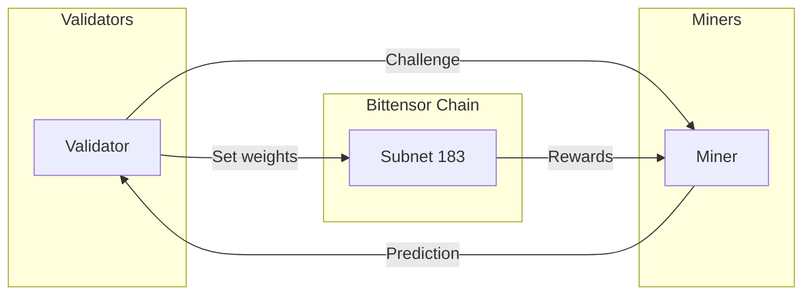

# **Bittbridge**
 

---

## The Incentivized AI

[Discord](https://discord.gg/) • [Network](https://taostats.io/)

---

## What is Bittbridge?

Bittbridge is a Bittensor subnet for New England energy demand (LoadMw) prediction. **Miners** serve predictions; **Validators** score them and set weights.

### High-Level Flow

Validators send challenges to miners. Miners respond with predictions. Validators evaluate accuracy, set weights on-chain, and miners earn rewards based on their scores.

---

## Quick start
**You need:** GitHub account, GCP free trial, tTAO (testnet tokens)

1. **Clone:** `git clone https://github.com/bittbridge/bittbridge.git`
2. **ISO-NE:** [Create account](https://www.iso-ne.com/isoexpress/login?p_p_id=com_liferay_login_web_portlet_LoginPortlet&p_p_lifecycle=0&p_p_state=maximized&p_p_mode=view&_com_liferay_login_web_portlet_LoginPortlet_mvcRenderCommandName=%2Flogin%2Fcreate_account&saveLastPath=false) → put username/password in `.env` (from `.env.example`)
3. **Check API:** `python test.py`
4. **Follow the four steps below** (GCP VM + moving average miner).

---

## Guide

| Step | Topic |
|------|--------|
| **1** | [Before you start](docs/guide/01-before-you-start.md) — ideas; clone URL |
| **2** | [GCP VM setup](docs/guide/02-gcp-vm-setup.md) — VM, firewall, clone, venv |
| **3** | [Wallets and tokens](docs/guide/03-wallets-and-tokens.md) — wallet, tTAO, register, **save UID**, `.env` |
| **4** | [Run miner](docs/guide/04-run-miner.md) — moving average in `neurons/miner.py` |

**Optional:** [Update and restart](docs/guide/update-and-restart.md) when the repo changes. **Optional:** [Incentive mechanism](docs/guide/incentive-mechanism.md) (how rewards work). **Optional:** [App workflow and Supabase](docs/guide/app-workflow-supabase.md) (plain-language data + prediction flow).

**Advanced** (not required for now): [docs/guide/advanced](docs/guide/advanced/README.md)

---
## Final Checklist

| ✅ | Task |
|---|------|
| | Github repo forked |
| | VM created |
| | Repo cloned on VM, venv activated |
| | Wallet created (miner); mnemonics stored |
| | tTAO balance is positive |
| | Miner hotkeys is registered to subnet 183; **UID saved** |
| | ISO-NE credentials in `.env` (ISO_NE_USERNAME, ISO_NE_PASSWORD) |
| | Miner running in tmux session (`python -m neurons.miner`) |
| | Detached from tmux (`Ctrl+b` `d`) – Miner running 24/7 |
| | Logs show Metagraph sync and request/response traffic |
---

## License

[MIT License](LICENSE)
