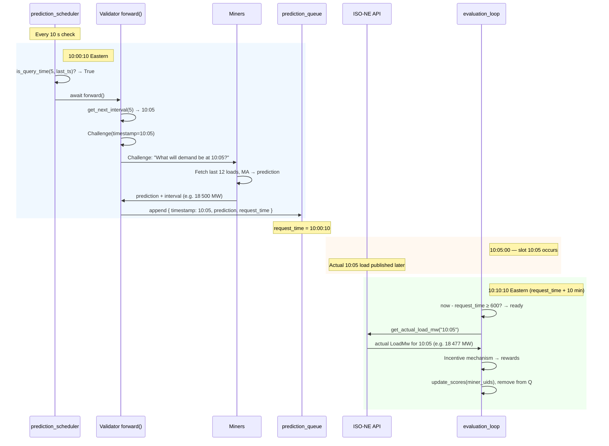
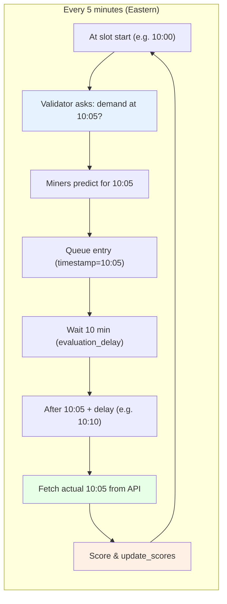

# Miner and Validator Architecture (with Timings)

This document explains how the **base miner** (`neurons/miner.py`) and **validator** work, with emphasis on **timings** and the flow of predictions.

---

## 1. App structure (relevant parts)

```
bittbridge/
├── neurons/
│   ├── miner.py          # Concrete miner (inherits BaseMinerNeuron, implements forward)
│   └── validator.py      # Concrete validator (async main, evaluation + prediction schedulers)
├── bittbridge/
│   ├── base/
│   │   ├── neuron.py     # BaseNeuron (sync, metagraph, weights)
│   │   ├── miner.py      # BaseMinerNeuron (axon, run loop by blocks)
│   │   └── validator.py  # BaseValidatorNeuron (dendrite, scores, set_weights)
│   ├── validator/
│   │   ├── forward.py    # forward(self) — build Challenge, query miners, push to queue
│   │   └── reward.py     # get_actual_load_mw, incentive mechanism rewards
│   ├── utils/
│   │   ├── timestamp.py  # Eastern time, 5-min rounding, is_query_time
│   │   └── iso_ne_api.py # ISO-NE 5-min system load (LoadMw)
│   └── protocol.py      # Challenge synapse (timestamp, prediction, interval)
```

- **Timezone**: All business timestamps use **Eastern (America/New_York)** to match ISO-NE and New England demand.
- **Protocol**: Validators send a `Challenge(timestamp=...)`; miners fill `prediction` and `interval`.
- **Intended semantics**: At time T the validator asks “what will total demand be in the **next** 5‑minute slot?” (e.g. at 10:00 it sends `timestamp=10:05`). After that slot has passed, the validator fetches actual demand for that slot from the API and scores the miner’s prediction.

---

## 2. Base miner (`neurons/miner.py`)

### 2.1 Role

- **Listens** for `Challenge` synapses from validators.
- For each challenge: fetches latest LoadMw from ISO-NE, computes a **moving average** over the last 12 × 5‑min steps (1 hour), returns **point prediction** and a **90% interval** (fixed 1% volatility).

### 2.2 How the miner runs

- **Entry point**: `if __name__ == "__main__"` uses `with Miner() as miner:` so the **base miner** runs in a **background thread** via `BaseMinerNeuron.__enter__` → `run_in_background_thread()` → `run()`.
- **`run()` (base/miner.py)**:
  1. `sync()` (check registered, optionally resync metagraph).
  2. **Serve** axon on the netuid and **start** the axon (so it can receive requests).
  3. **Loop**:
     - Wait until `(block - metagraph.last_update[uid]) >= config.neuron.epoch_length` (default **100 blocks**; Bittensor blocks ~12 s → ~20 min).
     - Then call `sync()` again (resync metagraph, etc.).
- The **main thread** then runs `while True: time.sleep(5)` and only logs; it does not drive requests.

So the miner has **no fixed “query” schedule**: it is **reactive**. Timing-wise, the only periodic behavior is **metagraph sync every `epoch_length` blocks** (~20 min by default). All prediction work happens **on demand** when a validator sends a `Challenge`.

### 2.3 Miner forward (when a Challenge arrives)

1. **`get_latest_load_mw_values(n_steps=12)`**
   - `get_now()` → current time in **Eastern**.
   - Fetch 5‑min system load for **today** (Eastern) from ISO-NE (`fiveminutesystemload/day/YYYYMMDD`).
   - If before **01:30 Eastern**, also fetch **yesterday** and prepend so there are enough points.
   - Take the last 12 LoadMw values; if fewer, return `None` (miner then returns synapse without prediction).
2. **`predict_next_load_ma(load_values, n_steps=12)`**  
   - Simple moving average of the last 12 values → point prediction.
3. **Optional**: if `--test`, add random noise to the prediction.
4. **`estimate_interval(prediction)`**  
   - Naive 90% interval: ±1.64 × 1% × prediction.
5. Set `synapse.prediction` and `synapse.interval` and return.

So **miner-side timing** is “at request time”: whatever “now” is in Eastern when the validator’s request is handled; the miner uses that moment to choose “today” (and possibly “yesterday”) and the last 12 × 5‑min slots for the MA.

---

## 3. Validator

The **concrete validator** (`neurons/validator.py`) does **not** use the base validator’s synchronous `run()` loop. It runs an **async** `main()` with three concurrent tasks.

### 3.1 Entry point and tasks

```python
async def main():
    validator = Validator()
    eval_task   = asyncio.create_task(validator.evaluation_loop(evaluation_delay=600, check_interval=10))
    pred_task   = asyncio.create_task(prediction_scheduler(validator))
    resync_task = asyncio.create_task(metagraph_resync_scheduler(validator, resync_interval=60))
    await asyncio.gather(eval_task, pred_task, resync_task)
```

- **prediction_scheduler**: decides **when** to query miners and calls `validator.forward()`.
- **evaluation_loop**: after a delay, evaluates predictions against actual load and updates scores.
- **metagraph_resync_scheduler**: periodically resyncs metagraph (and optionally could call `sync()` for set_weights; see below).

---

## 4. Validator timings (in detail)

### 4.1 Prediction interval and query cadence

- **Prediction interval**: **5 minutes** (one 5‑min slot per “epoch”).
- **`prediction_scheduler`** loop (simplified):
  - `prediction_interval = 5` (minutes).
  - `timestamp = to_str(round_to_interval(get_now(), interval_minutes=5))` (Eastern, rounded to nearest 5 min).
  - Every **10 seconds** it checks:
    - `query_lag = elapsed_seconds(get_now(), to_datetime(timestamp))`.
    - If **either**:
      - `is_query_time(prediction_interval, timestamp)`, **or**
      - `query_lag >= 60 * prediction_interval` (300 s),
    - then it runs `await validator.forward()` and updates `timestamp` to the current rounded 5‑min time.

So the validator **at most** queries every 5 minutes, and only when `is_query_time` says “we’re at the start of a new 5‑min epoch” (with tolerance), or when lag has reached 5 minutes.

### 4.2 `is_query_time(prediction_interval, timestamp, tolerance=120)` (timestamp.py)

- **Purpose**: “Should we send a new request in this epoch?”
- **Step 1**: `been_long_enough = elapsed_seconds(now, provided_timestamp) > tolerance` (120 s).  
  So we don’t query again until **at least 2 minutes** after the last query timestamp.
- **Step 2**: If not long enough → return `False`.
- **Step 3**: Compute position within the 5‑minute grid (Eastern):
  - `sec_since_open = elapsed_seconds(now, midnight)` (seconds since midnight Eastern).
  - `sec_since_epoch_start = sec_since_open % (prediction_interval * 60)` (seconds since last 5‑min boundary).
  - `beginning_of_epoch = sec_since_epoch_start < tolerance` (within first 120 s of the 5‑min slot).
- **Return**: `True` only if we’re in the **first 2 minutes** of a 5‑minute slot **and** the last query was more than 2 minutes ago.

So in practice the validator sends a challenge **roughly once per 5‑minute boundary**, within the first 2 minutes of each slot, and the scheduler loop checks every 10 s.

### 4.3 Forward (validator/forward.py)

When the scheduler calls `forward()`:

1. **Timestamp**: `timestamp = to_str(get_next_interval(interval_minutes=5))` (Eastern, **next** 5‑min slot, ISO string). So at 10:00 the validator asks for a prediction for **10:05**; at 10:05 it asks for **10:10**, etc.
2. **Miners**: `get_random_uids(self, k=self.config.neuron.sample_size)` (default 50) → `selected_axons`.
3. **Challenge**: `Challenge(timestamp=timestamp)`.
4. **Query**: `await self.dendrite(axons=selected_axons, synapse=challenge, deserialize=False)`.
5. **Queue**: For each response with `response.prediction is not None`, append to `self.prediction_queue`:
   - `timestamp`, `miner_uid`, `prediction`, `interval`, and **`request_time=time.time()`** (POSIX).

So the **validator-side timestamp** is the **next** 5‑min slot (Eastern). That same timestamp is used when fetching **actual** load for scoring, so we compare “miner’s prediction for 10:05” with “actual demand at 10:05”.

---

## 5. Evaluation loop (when predictions are scored)

- **`evaluation_loop(evaluation_delay=600, check_interval=10)`**:
  - Every **10 s** it scans `prediction_queue` for entries where `now - request_time >= evaluation_delay` (600 s = **10 minutes**).
  - Rationale: ISO-NE 5‑min load for a given slot is only available after that slot; 10 minutes gives a safe delay so the actual value can be fetched.
  - For each such entry it:
    - Groups by `timestamp`.
    - For each timestamp, gets **actual LoadMw** via `get_actual_load_mw(timestamp)` (ISO-NE API, 5‑min slot).
    - Builds mock `Challenge` responses (prediction + interval) and calls **incentive mechanism** `get_incentive_mechanism_rewards(...)` to get rewards and updated weights.
    - Calls `update_scores(rewards, miner_uids)` and updates `previous_weights`.
    - Removes those entries from the queue.

So the **timing** of scoring is: **request_time + 10 minutes** → then score using actual load for that 5‑min slot.

---

## 6. Metagraph and weights

- **metagraph_resync_scheduler**: every **60 s** calls `validator.resync_metagraph()` (no `sync()`).
- **`sync()`** (base/neuron.py) would also call `check_registered()`, and if `should_sync_metagraph()` / `should_set_weights()` then `resync_metagraph()` / `set_weights()`, and always `save_state()`. The current async validator **only** runs `resync_metagraph()` in the scheduler, so **set_weights() and the full sync() are not invoked** by the async loop. If you want weights on chain and state saves on a schedule, you’d need to call `validator.sync()` periodically (e.g. from the same scheduler or a fourth task), subject to `epoch_length` (blocks) for when weights are actually set.

---

## 7. Timeline summary

| Actor        | What happens | Typical timing |
|-------------|---------------|----------------|
| Validator   | prediction_scheduler loop | Every **10 s** check |
| Validator   | Decide to query | When `is_query_time(5, last_ts)` or lag ≥ 5 min; effectively **once per 5‑min boundary** (first 2 min of slot) |
| Validator   | forward()     | Build Challenge with **current time rounded to 5 min (Eastern)**; query `sample_size` miners; append to queue with `request_time=now` |
| Miner       | Serves axon   | Always; reacts when Challenge arrives |
| Miner       | forward()     | On each Challenge: get “now” Eastern, fetch today (and maybe yesterday) ISO-NE data, MA over last 12 points, return prediction + interval |
| Miner       | Metagraph sync| Every **epoch_length** blocks (~100 blocks ≈ 20 min) in base run loop |
| Validator   | evaluation_loop | Every **10 s**; process queue entries with `now - request_time >= 600` |
| Validator   | Score predictions | **10 min** after `request_time`; use actual LoadMw for that 5‑min slot |
| Validator   | Metagraph resync | Every **60 s** (resync only; no set_weights in current code) |

---

## 8. Flow diagram with timings

All times are **Eastern**. The diagram below traces one prediction cycle: ask at 10:00 for demand at 10:05, then evaluate after 10:05 using API ground truth.

### 8.1 Sequence diagram (one 5‑min cycle)



### 8.2 High-level flowchart (timings)

```mermaid
flowchart LR
    subgraph T0["⏱ 10:00 (Eastern)"]
        A[Validator: is_query_time?]
        B[forward: get_next_interval → 10:05]
        C[Challenge to miners: predict 10:05]
    end

    subgraph T1["⏱ ~10:00:12"]
        D[Miners: MA of last 12 → prediction]
        E[Queue: timestamp=10:05, request_time=now]
    end

    subgraph T2["⏱ 10:05"]
        F[Slot 10:05 occurs]
    end

    subgraph T3["⏱ 10:10 (request_time + 10 min)"]
        G[Evaluation: get_actual_load_mw(10:05)]
        H[Score predictions vs actual]
        I[update_scores, remove from queue]
    end

    A --> B --> C --> D --> E
    E -.->|"wait evaluation_delay (600 s)"| F
    F -.->|"API has 10:05 data"| G
    G --> H --> I
```

### 8.3 Repeating 5‑minute cycle



- **Blue**: Validator asks for the **next** 5‑min slot (10:05 when it’s 10:00).
- **Green**: After that slot and the 10‑min delay, validator fetches **ground truth** for that slot.
- **Orange**: Scores are computed and applied; queue entry is removed.

---

## 9. Example flow with timestamps (detailed table)

All times below are **Eastern (America/New_York)**. The example follows one 5‑minute prediction slot from query to score.

**Assumptions:** Validator and miners are running; the last validator query was before 08:00 so `is_query_time` will allow a new query once we enter the first 2 minutes of the next 5‑min slot.

| Time (Eastern) | Actor | What happens |
|----------------|--------|---------------|
| **10:00:00** | — | Start of 5‑min slot (10:00–10:05). ISO-NE slot “10:00” means load for that interval. |
| **10:00:10** | Validator | `prediction_scheduler` wakes (every 10 s). `get_now()` ≈ 10:00:10. `is_query_time(5, last_timestamp)` → **True** (first 2 min of 10:00 slot, last query >2 min ago). `is_query_time(5, last_timestamp)`: we’re in first 2 min of 10:00 slot and last query was &gt;2 min ago → **True**. |
| **10:00:10** | Validator | `forward()`: `get_next_interval(5)` → **10:05**. Builds `Challenge(timestamp="2026-03-09T10:05:00-04:00")` — "What will demand be at **10:05**?" (or equivalent ISO with Eastern offset). Selects 50 miners, sends challenge. `request_time = time.time()` (e.g. POSIX 1749 234 610). |
| **10:00:10–10:00:12** | Miners | Each miner receives Challenge. For miner A: `get_now()` ≈ 10:00:10–10:00:12 Eastern; fetches today’s 5‑min load, last 12 points (e.g. 09:05–10:00), MA → e.g. 18 500 MW, interval [18 317, 18 683]. Fills synapse and returns. |
| **10:00:12** | Validator | Dendrite collects responses. For each miner with `prediction` set, appends to `prediction_queue`: `{ "timestamp": "2026-03-09T10:05:00-04:00", "miner_uid": ..., "prediction": ..., "interval": ..., "request_time": 1749234610 }`. |
| **10:02:00** | Validator | Next 5‑min boundary (10:05) not yet in “first 2 min”; at 10:02:xx `is_query_time` may fire again for slot **10:05** (timestamp rounded to 10:05). Another forward() run; new entries in queue with `timestamp` = 10:05 and new `request_time`. |
| **10:10:10** | Validator | `evaluation_loop` wakes. For queue entry from 10:00:10: `now - request_time` ≈ 600 s → **≥ 600**. Entry is “ready”. |
| **10:10:10** | Validator | For that entry: `get_actual_load_mw("2026-03-09T10:05:00-04:00")` → fetches ISO-NE 5‑min load for the **10:05** slot (e.g. 18 477 MW). Groups all entries with same timestamp, runs incentive mechanism, computes rewards, `update_scores(rewards, miner_uids)`, removes from queue. |

**Summary of this slot:**

- **Challenge timestamp**: 10:05 (Eastern) — validator asks “what will demand be at 10:05?”; i.e. “predict for the 10:05 5‑min slot” (or “next” from validator’s perspective; in practice scoring uses actual load for that 10:05 slot).
- **Request time**: ~10:00:10 (when the validator sent the challenge).
- **Score time**: ~10:10:10 (10 minutes later), using actual LoadMw for **10:05** from ISO-NE.

So the flow is: **ask every 5 min what demand will be in the *next* 5 min → after that slot, get ground truth for that slot and evaluate**.

---

## 10. Config knobs (timing-related)

- **Miner**: `neuron.epoch_length` (default 100 blocks) — how often metagraph is synced in the run loop.
- **Validator**: `neuron.sample_size` (default 50) — how many miners are queried per forward; `neuron.timeout` (default 10 s) — dendrite timeout per forward.
- **Validator (hardcoded in neurons/validator.py)**: `prediction_interval=5` (minutes), `evaluation_delay=600` (seconds), `check_interval=10` (evaluation loop), scheduler sleep 10 s, `resync_interval=60` (seconds), `tolerance=120` in `is_query_time`.

This is how the base miner and validator work and how their timings interact end to end.
