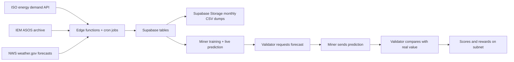

# App Workflow and Supabase (Beginner Guide)

This page explains, in simple words, how Bittbridge works from data collection to miner predictions and validator scoring.

If you are new, think about the system as **three connected parts**:

1. Data pipelines (collect and prepare data)
2. Supabase (stores and serves data)
3. Miners + Validators (use data for predictions, evaluation and rewards)

---

## 1) Big Picture

In short:
- External APIs provide demand, historical station weather (IEM), and **National Weather Service** forecast data.
- Scheduled jobs clean and transform the data so tables stay aligned with what models expect.
- Supabase stores both historical and forecast-ready datasets.
- After training, the miner talks to Supabase over the API for live rows (forecast features + recent history when needed).
- Validators score accuracy and set rewards.

---

## 2) Supabase Data Sources

The app uses two core Supabase tables.

### `hackathon-test-data`

What it is used for:
- Historical dataset from **January 2024 to the most recent period**.
- Built by a scheduled pipeline using:
  - ISO energy demand data
  - ASOS/AWOS/METAR weather data from the IEM source:
    - [ASOS-AWOS-METAR Data Download](https://mesonet.agron.iastate.edu/request/download.phtml?network=CT_ASOS)

Why it exists:
- It is the large base dataset for model work.
- To reduce load on table/API reads, an additional cron job creates monthly CSV chunks and updates them in Supabase Storage, so miners can download training data faster.

**How the miner uses it after deploy:** In the default config, this table is `supabase_test_table`. For each validator challenge, the miner loads the **one row** that matches the requested **target timestamp** (and forecast horizon, if applicable). That row carries the **forecast-side features** for that future datapoint, already shaped to match training. The same feature-engineering step as in training is applied so **tensor shapes and column sets stay consistent**.

### `hackathon-train-data`

What it is used for:
- **Weather used for live forecasting** is pulled from the **National Weather Service** ([weather.gov](https://www.weather.gov)), then transformed so column names and layout **match the training dataset**, and written into this table via edge functions and cron jobs.
- This keeps a **stream of recent rows** aligned with how models were trained (same schema as the historical pipeline).

Why it exists:
- It backs **fresh, NWS-based** rows that match training, without each miner calling NWS directly.

**How the miner uses it after deploy:** In the default `model_params.yaml`, this table is `supabase_train_table`. The miner uses it to load a **short tail of the most recent rows** when the model needs **past context**—for example load lags, rolling statistics, or sequence windows (LSTM/RNN). The database keeps updating on a schedule; the miner only reads the latest state.

> Note: the table names can feel counterintuitive (`test` vs `train`). Keep in mind that each table has a specific role in the pipeline, even if the name sounds opposite.

---

## 3) How Data Moves (Step by Step)

1. **Collect:** Cron + edge functions pull ISO demand and IEM ASOS for the long historical dataset. **National Weather Service** ([weather.gov](https://www.weather.gov)) forecast-side data is pulled separately, transformed to **match the training schema**, and maintained on a schedule (see `hackathon-train-data` above).
2. **Transform:** Pipelines standardize timestamps, clean columns, and align schemas so **training rows and live rows use the same feature shape**.
3. **Store in Supabase tables:** Fresh data is written into the two main tables (refreshed on a schedule).
4. **Create storage dumps:** Another cron process exports monthly CSV parts to Supabase Storage.
5. **Training time:** Miner loads history from storage CSVs and/or Supabase, trains a model, and saves artifacts (weights, feature list, etc.).
6. **Deploy:** Miner runs with the trained model and listens for validator challenges.
7. **Live forecast request:** Validator sends a target timestamp; the miner must answer with a point forecast.
8. **Live inference (see next section):** Miner calls Supabase to load the forecast row and, if the model needs it, a **tail of recent train rows**.
9. **Scoring:** Validator compares prediction vs actual demand and assigns score/reward.

---

## 4) Deployed miner: how live prediction uses Supabase

After you train and deploy, the advanced miner path does **not** rely only on static CSVs for each answer. For each validator request it uses the **Supabase API** (same database the pipelines keep updated):

1. **Forecast row for the asked time**  
   The miner queries the table set as `supabase_test_table` (default `hackathon-test-data`) for a row whose timestamp (and forecast horizon, if configured) matches what the validator requested. That row is the **feature vector for the future datapoint** the validator named.

2. **Same shape as training**  
   The pipeline in code loads that row, runs the **same** feature steps as training (filters, engineered columns, optional load-from-history features), and builds a matrix that matches the **saved model’s expected feature list**. If something is missing, inference errors with a clear message so you do not get a silent shape mismatch.

3. **Recent history from `supabase_train_table` when needed**  
   If the model uses **lags, rolling load stats, or sequence models** (LSTM/RNN), the miner also calls Supabase to fetch the **latest tail** of rows from `supabase_train_table` (default `hackathon-train-data`). Those rows supply **recent demand (and related columns)** so the client can compute lag/rolling/sequence inputs that are consistent with training.

4. **Automatic refresh**  
   You do not manually reload the database: edge functions and cron jobs keep inserting/updating rows. The miner simply reads the current state when a challenge arrives.

Together, this is the end-to-end **train once (often from storage CSVs), answer many times with live Supabase reads** workflow. Names in YAML (`supabase_train_table` / `supabase_test_table`) refer to **history tail** vs **target forecast row** in code, not the words “train” or “test” in the table names—see defaults in `miner_model_energy/model_params.yaml`.

---

## 5) Why Monthly CSV Dumps in Supabase Storage

Without dumps, every miner would repeatedly query large Supabase tables.

Monthly CSV dumps solve this by:
- reducing load on Supabase database reads,
- speeding up miner startup/training,
- giving a stable and easy-to-download training dataset format.

---

## 6) What a New User Should Remember

- **APIs are the source**: ISO demand; IEM ASOS for long historical context; **NWS (weather.gov)** for forecast-side weather aligned with training.
- **Edge functions + cron jobs are the automation**: they continuously fetch, transform, and refresh Supabase.
- **Supabase is the hub**: tables for live reads (forecast + history tail), storage for bulky monthly training CSVs.
- **Deployed miner**: Supabase API calls per challenge—forecast row (+ train tail if lags/sequences)—then same feature pipeline as training.
- **Validators score**: better predictions lead to better rewards.

---

[Guide](../../README.md#guide)
