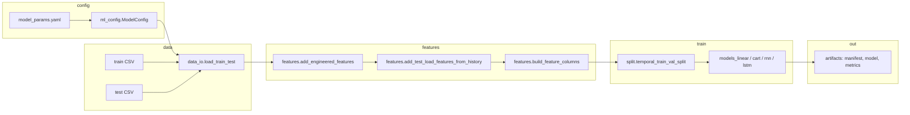

# Miner model energy — architecture

This package predicts **system load** (MW) from time-series CSV data. The target column is `Total Load`; the primary time column is `dt`. Training follows the same conceptual pipeline as the exploratory notebook (`ExampleMinerModels_UPDATED_with_load_lags.ipynb`), but is split into small modules for configuration, I/O, features, models, and artifact persistence.

## Purpose

- **Train** regressors (linear, decision tree, RNN, or LSTM) on historical 5-minute (or similar) load data.
- **Evaluate** with a temporal train/validation split and standard regression metrics (RMSE, MAE, MAPE, R²).
- **Persist** each run under a timestamped directory: model file, `manifest.json`, `metrics.json`, and a frozen `config_snapshot.yaml`.
- **Support inference** on a small test frame (often a single future row), including correct handling of load lags when the test CSV does not repeat full history.

## High-level flow



End-to-end training is orchestrated in `pipeline.py` (`prepare_training_data` → `train_model` → optional `persist_training_result`).

## Module map

| Module | Responsibility |
|--------|----------------|
| `ml_config.py` | Load and validate `model_params.yaml` into a frozen `ModelConfig` (paths exist, validation split bounds, feature booleans normalized). |
| `data_io.py` | Read train/test CSVs, parse `dt`, sort by time, enforce required columns (`dt`, `Total Load` on train). |
| `features.py` | Optional time/cyclical columns, load lags and deltas (shifted to avoid target leakage), alignment of test lags from train tail, and building the final feature column list. |
| `split.py` | **Temporal** train/validation split (first chunk train, last chunk validation — no random shuffle). |
| `models_linear.py` | `StandardScaler` + `sklearn.linear_model.LinearRegression`; joblib bundle. |
| `models_cart.py` | `sklearn.tree.DecisionTreeRegressor` (CART); joblib bundle. |
| `models_lstm.py` | Keras `Sequential` LSTM → Dropout → optional Dense → Dense(1); sliding windows via `make_sequences`; saves `.keras`. Requires TensorFlow. |
| `models_rnn.py` | Same pattern as LSTM but `SimpleRNN`; own bundle, scaler file, and manifest keys (`rnn_*`). |
| `pipeline.py` | Glue: data prep, training per model type, metrics, single-row test prediction, sequence window assembly for RNN/LSTM on short test sets, persistence and manifest loading. |
| `artifacts.py` | Timestamped run directories, `manifest.json`, `config_snapshot.yaml`, SHA-256 feature signature. |
| `inference_runtime.py` | Optional integration: moving-average baseline from ISO-NE API vs `AdvancedModelPredictor` wrapping `TrainingResult`; `PredictorRouter` switches implementation. |
| `run_training_smoke.py` | CLI entry: load config, train one model, print metrics and one test prediction. |

Package docstring lives in `__init__.py`.

## Configuration (`model_params.yaml`)

The checked-in file lives next to the `miner_model_energy` package (`bittbridge/model_params.yaml`). Run CLIs with working directory `bittbridge/` so relative paths inside the YAML (CSVs, `artifact_dir`, cache) resolve correctly.

Sections:

- **`data`** — `train_csv` and `test_csv` paths (validated at load time).
- **`features`** — Toggles (default **off** in sample YAML): time, cyclical, station aggregates, temp–dew gap, `use_load_lags` + `load_lag_steps`, `use_load_rolling` + `rolling_load_windows`, standalone `use_load_delta`, and `include_weather_suffix_groups` (empty = **drop** all raw `*-tmpf` / `*-dwpf` / …; non-empty = **keep only** listed suffixes). Mirrors `ExampleMinerModels_UPDATED_with_load_lags.ipynb`; disabled groups are stripped so train/test stay aligned.
- **`training`** — `validation_split`, `random_state`, and `show_training_progress` (phased `[train]` logs + timings during `train_model`). Model choice is not in YAML: miner preflight or `run_training_smoke.py --model`.
- **`models`** — Per-model hyperparameters; `lstm` / `rnn` share the same Keras-style options (`fit_verbose` 0/1/2, early stopping, etc.). Linear/CART have no sklearn progress bar; phases still show where time is spent.
- **`persistence`** — `artifact_dir` root for saved runs; `save_on_deploy` flag for downstream use.

## Feature engineering (details)

1. **Excluded from features** (by design): `dt`, `Total Load`, several alternate load columns, and `load_change_1h` — see `DEFAULT_EXCLUDE_COLS` in `features.py`.
2. **Train-only lags**: `load_lag_*` and `load_delta_*` use **shifted** target so the current row’s target is not leaked into inputs.
3. **Test rows**: If any of `use_load_lags`, `use_load_rolling`, or `use_load_delta` is on, `add_test_load_features_from_history` fills those columns from the **tail of the training load series** (broadcast to every test row when the test file has multiple rows).
4. **Column alignment**: `build_feature_columns(train, test=test)` keeps only columns present on **both** frames. If train has extra columns, `prepare_training_data` warns and drops them so inference never requires missing test columns.

## Training and metrics

- After engineering, rows with NaN in any selected feature or target are dropped from the training frame.
- Validation is the **last** `validation_split` fraction of the time-ordered training data (`temporal_train_val_split`).
- Metrics: RMSE, MAE, MAPE, R² on train and validation predictions (`pipeline._metrics`).
- **LSTM / RNN**: Training uses sequences of length `n_steps`; the label for each sequence is the target at the end of the window. Validation sequences must be non-empty or training raises a clear error.

## Inference quirks

- **`predict_single_test_row`**: Uses the first row of the linear/cart test matrix, or for RNN/LSTM builds a `(n_steps, n_features)` window via `build_sequence_inference_matrix` (`build_lstm_inference_matrix` remains an alias) — if the test frame has fewer than `n_steps` rows, the missing prefix is taken from the **end of the training** feature matrix so the network sees a full window.

## Artifacts layout

Each `persist_training_result` call creates a directory like:

`{artifact_dir}/{UTC_timestamp}_{model_type}_{run_id}/`

Typical contents:

- `model_linear.joblib` \| `model_cart.joblib` \| `model_rnn.keras` \| `model_lstm.keras`
- `manifest.json` — model type, paths, feature list, feature signature hash, row counts, metrics, timings, `rnn_n_steps` / `lstm_n_steps` when relevant
- `metrics.json`
- `config_snapshot.yaml` — copy of effective config for reproducibility

`load_training_bundle_from_manifest` reads `manifest.json` and returns the appropriate bundle (linear/cart/RNN/LSTM) for reloading.

## Related runtime code

`inference_runtime.py` defines:

- **`BaselineMovingAveragePredictor`** — last *n* five-minute loads from ISO-NE (`fetch_fiveminute_system_load`), averaged.
- **`AdvancedModelPredictor`** — delegates to `predict_single_test_row` on a held `TrainingResult`.
- **`PredictorRouter`** — swaps the active predictor and exposes a `mode` label.

This layer is separate from CSV training but uses the same prediction path for the advanced path.

## How to run a quick train

From the `bittbridge` package context (paths in YAML are relative to how you invoke Python / cwd):

```bash
python -m miner_model_energy.run_training_smoke --config model_params.yaml --model linear
```

Adjust `--model` to `cart`, `rnn`, or `lstm` as needed. RNN/LSTM require TensorFlow installed.

## Dependency summary

- **Core**: `pandas`, `numpy`, `scikit-learn`, `pyyaml`, `joblib`.
- **RNN / LSTM**: `tensorflow` (Keras).
- **inference_runtime**: `bittbridge.utils.iso_ne_api`, `bittbridge.utils.timestamp`.
